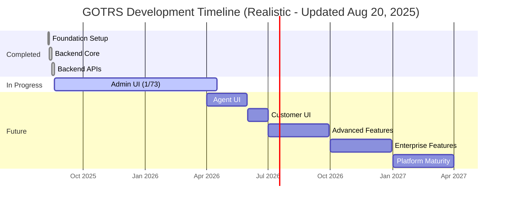

# GOTRS Development Roadmap

## ⚠️ IMPORTANT STATUS UPDATE (August 20, 2025)

**Reality Check**: Previous roadmap claims were overly optimistic. This document now reflects the TRUE state of the project.

### What's ACTUALLY Complete:
- ✅ **Backend Core**: Authentication, APIs, database layer (Phase 1)
- ✅ **Backend Services**: Most ticket, queue, and user management APIs (Phase 2 backend)
- ⚠️ **Admin UI**: **12 of 71 modules complete** (16.9% done)
- ❌ **Agent UI**: Not started
- ❌ **Customer UI**: Basic skeleton only

### The Truth About Our "UI Completion":
We claimed the UI was done, but now we have:
- 12 admin modules fully implemented with proper UX
- 59 admin modules still need to be built
- Each module requires 2-5 days with proper TDD and UX standards
- **Realistic timeline: 6-7 months for complete admin UI**

## Current Priority: ADMIN UI IMPLEMENTATION 🚨

**THIS IS OUR #1 PRIORITY** - Without the admin UI, GOTRS is not usable.

## Timeline Visualization (UPDATED - REALISTIC)

## Phase 2A: Admin UI Implementation (CURRENT - TOP PRIORITY)

**Status**: 12 of 71 modules complete (16.9%)  
**Timeline**: August 2025 - April 2026 (8 months)  
**Quality Bar**: Every module must meet or exceed `/admin/users` standards

### Admin UI Module Checklist (71 Total)

#### Users, Groups & Permissions (10 modules) - Weeks 1-4
- [x] **AdminUser** - User Management ✅ COMPLETE (High quality standard set)
- [x] **AdminGroup** - Group Management ✅ COMPLETE (Aug 20, 2025)
- [x] **AdminPermissions** - Permission Management (OTRS Role equivalent) ✅ COMPLETE (Dec 28, 2025)
- [x] **AdminUserGroup** - User ↔ Group Relations ✅ INTEGRATED into AdminGroup (Dec 28, 2025)
- [ ] **Note: Roles removed** - OTRS uses Groups as primary access control, not separate Roles
- [x] **AdminCustomerUser** - Customer User Management ✅ COMPLETE (Dec 28, 2025)
- [x] **AdminCustomerCompany** - Customer Company Management ✅ COMPLETE (Dec 28, 2025)
- [ ] **AdminCustomerGroup** - Customer ↔ Group Relations
- [x] **AdminCustomerUserGroup** - Customer User ↔ Group Relations ✅ COMPLETE (Aug 21, 2025)
- [ ] **AdminCustomerUserCustomer** - Customer User ↔ Customer Relations
- [ ] **AdminCustomerUserService** - Customer User ↔ Service Relations

#### Ticket Settings (14 modules) - Weeks 5-8
- [x] **AdminQueue** - Queue Management ✅ COMPLETE (Dec 28, 2025)
- [ ] **AdminQueueAutoResponse** - Queue ↔ Auto Response Relations
- [ ] **AdminQueueTemplates** - Queue ↔ Template Relations
- [x] **AdminPriority** - Priority Management ✅ COMPLETE (Dec 28, 2025)
- [x] **AdminState** - Ticket State Management ✅ COMPLETE (Aug 22, 2025 - TDD)
- [x] **AdminType** - Ticket Type Management ✅ COMPLETE (Aug 22, 2025 - TDD)
- [ ] **AdminService** - Service Management
- [ ] **AdminSLA** - Service Level Agreement Management
- [ ] **AdminAttachment** - Attachment Management
- [ ] **AdminTemplate** - Template Management
- [ ] **AdminTemplateAttachment** - Template ↔ Attachment Relations
- [ ] **AdminAutoResponse** - Auto Response Management
- [ ] **AdminSalutation** - Salutation Management
- [ ] **AdminSignature** - Signature Management

#### Email & Communication (8 modules) - Weeks 9-12
- [ ] **AdminSystemAddress** - System Email Address Management
- [ ] **AdminMailAccount** - Mail Account Management
- [ ] **AdminPostMasterFilter** - PostMaster Filter Management
- [ ] **AdminEmail** - Email Management
- [ ] **AdminNotificationEvent** - Notification Event Management
- [ ] **AdminPGP** - PGP Key Management
- [ ] **AdminSMIME** - S/MIME Certificate Management
- [ ] **AdminCommunicationLog** - Communication Log Viewer

#### Dynamic Fields (6 modules) - Weeks 13-16
- [ ] **AdminDynamicField** - Dynamic Field Management
- [ ] **AdminDynamicFieldText** - Text Dynamic Fields
- [ ] **AdminDynamicFieldDropdown** - Dropdown Dynamic Fields
- [ ] **AdminDynamicFieldMultiselect** - Multiselect Dynamic Fields
- [ ] **AdminDynamicFieldCheckbox** - Checkbox Dynamic Fields
- [ ] **AdminDynamicFieldDateTime** - DateTime Dynamic Fields

#### Process Management (6 modules) - Weeks 17-20
- [ ] **AdminProcessManagement** - Process Management Overview
- [ ] **AdminProcessManagementActivity** - Activity Management
- [ ] **AdminProcessManagementActivityDialog** - Activity Dialog Management
- [ ] **AdminProcessManagementPath** - Path Management
- [ ] **AdminProcessManagementTransition** - Transition Management
- [ ] **AdminProcessManagementTransitionAction** - Transition Action Management

#### Web Services (13 modules) - Weeks 21-24
- [ ] **AdminGenericInterfaceWebservice** - Web Service Management
- [ ] **AdminGenericInterfaceWebserviceHistory** - Web Service History
- [ ] **AdminGenericInterfaceDebugger** - Web Service Debugger
- [ ] **AdminGenericInterfaceOperationDefault** - Operation Management
- [ ] **AdminGenericInterfaceInvokerDefault** - Invoker Management
- [ ] **AdminGenericInterfaceInvokerEvent** - Invoker Event Management
- [ ] **AdminGenericInterfaceMappingSimple** - Simple Mapping
- [ ] **AdminGenericInterfaceMappingXSLT** - XSLT Mapping
- [ ] **AdminGenericInterfaceTransportHTTPREST** - REST Transport
- [ ] **AdminGenericInterfaceTransportHTTPSOAP** - SOAP Transport
- [ ] **AdminGenericInterfaceErrorHandlingDefault** - Error Handling
- [ ] **AdminGenericInterfaceErrorHandlingRequestRetry** - Request Retry

#### System Administration (11 modules) - Weeks 25-28
- [ ] **AdminSystemConfiguration** - System Configuration
- [ ] **AdminSystemConfigurationDeployment** - Configuration Deployment
- [ ] **AdminSystemConfigurationGroup** - Configuration Groups
- [ ] **AdminPackageManager** - Package Management
- [ ] **AdminRegistration** - System Registration
- [ ] **AdminSession** - Session Management
- [ ] **AdminSelectBox** - Database Query Tool
- [ ] **AdminLog** - System Log Viewer
- [ ] **AdminPerformanceLog** - Performance Log Viewer
- [ ] **AdminSupportDataCollector** - Support Data Collection
- [ ] **AdminSystemMaintenance** - System Maintenance

#### Calendar & Other (9 modules) - Weeks 29-32
- [ ] **AdminAppointmentCalendarManage** - Calendar Management
- [ ] **AdminAppointmentImport** - Appointment Import
- [ ] **AdminAppointmentNotificationEvent** - Appointment Notifications
- [ ] **AdminGenericAgent** - Generic Agent Configuration
- [ ] **AdminCloudServices** - Cloud Service Management
- [ ] **AdminCloudServiceSupportDataCollector** - Cloud Support Data
- [ ] **AdminOTRSBusiness** - OTRS Business Features
- [ ] **AdminInit** - System Initialization
- [ ] **Admin** - Admin Dashboard

### Quality Requirements for Each Module

Every admin module MUST include:

1. **Search & Filtering**
   - Real-time search
   - Column sorting
   - Status/type filters
   - Clear filter button

2. **CRUD Operations**
   - Create with validation
   - Read with pagination
   - Update with confirmation
   - Delete/deactivate with warning

3. **User Experience**
   - Modal dialogs with proper styling
   - Dark mode support
   - Loading indicators
   - Success/error feedback
   - Tooltips on all actions

4. **Data Persistence**
   - Session state preservation
   - Search/filter state maintained
   - Form data recovery

5. **Testing (TDD Required)**
   - Unit tests for business logic
   - Integration tests for database
   - UI tests for interactions
   - Accessibility tests
   - Error scenario coverage

## Realistic Development Velocity

### Previous False Claims (Now Corrected)
- ❌ Claimed: "Phase 2 done in 1 day" - FALSE (only backend APIs done)
- ❌ Claimed: "30x velocity" - FALSE (UI takes proper time)
- ❌ Claimed: "UI complete" - FALSE (only 1.4% done)

### Actual Velocity for UI Work
- **AdminUser module**: 3 days to reach quality standard
- **Average per module**: 2-5 days depending on complexity
- **Total for 73 modules**: ~32 weeks (8 months)
- **No shortcuts**: Quality cannot be rushed

## Phase Timeline (Realistic)

### Phase 0: Foundation ✅ COMPLETE
- Project setup, Docker environment, database schema
- **Completed**: August 10-12, 2025 (2 days)

### Phase 1: Backend Core ✅ COMPLETE  
- Authentication, RBAC, core APIs, database layer
- **Completed**: August 12-16, 2025 (4 days)

### Phase 2: Full System Implementation
#### Phase 2A: Backend APIs ✅ COMPLETE
- Ticket, queue, user, service APIs
- **Completed**: August 16-19, 2025 (3 days)

#### Phase 2B: Admin UI 🚧 IN PROGRESS
- 73 admin modules with full TDD
- **Progress**: 1 of 73 complete (1.4%)
- **Timeline**: August 2025 - April 2026 (8 months)

#### Phase 2C: Agent UI (Not Started)
- Ticket management interface
- Dashboard and reporting
- **Timeline**: April - June 2026 (2 months)

#### Phase 2D: Customer UI (Not Started)
- Self-service portal
- Ticket submission and tracking
- **Timeline**: June - July 2026 (1 month)

### Phase 3: Advanced Features
- Workflow automation
- Business process management
- Advanced integrations
- **Timeline**: July - October 2026 (3 months)

### Phase 4: Enterprise Features
- High availability
- Performance optimization
- Security hardening
- **Timeline**: October 2026 - January 2027 (3 months)

### Phase 5: Innovation
- AI/ML integration
- Mobile applications
- Advanced analytics
- **Timeline**: January - April 2027 (3 months)

### Phase 6: Platform Maturity
- Plugin ecosystem
- SaaS deployment
- Market readiness
- **Timeline**: April - July 2027 (3 months)

## Release Schedule (Updated - Realistic)

| Version | Target Date | Status | Notes |
|---------|------------|--------|-------|
| 0.1.0-alpha | Aug 16, 2025 | ✅ Released | Backend core complete |
| 0.2.0-alpha | Aug 19, 2025 | ✅ Released | Backend APIs complete |
| 0.3.0-beta | Oct 2025 | Pending | 25% Admin UI complete |
| 0.4.0-beta | Dec 2025 | Pending | 50% Admin UI complete |
| 0.5.0-beta | Feb 2026 | Pending | 75% Admin UI complete |
| 0.6.0-rc | Apr 2026 | Pending | 100% Admin UI complete |
| 0.7.0-rc | Jun 2026 | Pending | Agent UI complete |
| 0.8.0-rc | Jul 2026 | Pending | Customer UI complete |
| 1.0.0 | Oct 2026 | Pending | Production release |

## Success Metrics (Realistic)

### Current Reality
- ✅ Backend test coverage: 83.4%
- ⚠️ Admin UI completion: 16.9% (12/71 modules)
- ❌ Agent UI: 0%
- ❌ Customer UI: 0%

### Target Metrics
- [ ] 100% Admin UI modules complete
- [ ] 95% test coverage overall
- [ ] All modules meet `/admin/users` quality standard
- [ ] Full accessibility compliance
- [ ] Complete i18n support

## Why This Timeline Is Realistic

1. **Quality Takes Time**: Each admin module needs:
   - Proper TDD (write tests first)
   - Full CRUD implementation
   - Search, filter, sort functionality
   - Modal dialogs and forms
   - Error handling and validation
   - Dark mode support
   - Accessibility features
   - Session state management

2. **No Shortcuts**: The `/admin/users` module took multiple iterations to reach acceptable quality. We must maintain this standard for all 73 modules.

3. **Technical Debt**: Rushing UI development creates technical debt that slows future development.

4. **User Experience**: A poor admin interface will kill adoption. Quality matters more than speed.

## Development Principles Going Forward

1. **Honesty**: Report actual progress, not wishful thinking
2. **Quality First**: Never compromise UX for speed
3. **TDD Always**: Write tests before implementation
4. **Incremental Delivery**: Ship working modules regularly
5. **User Feedback**: Test with real users early and often

## Getting Involved

We need help! With 72 admin modules to build, contributions are welcome:

1. **Pick a Module**: Choose an unimplemented admin module
2. **Follow Standards**: Match the `/admin/users` quality bar
3. **Write Tests First**: TDD is mandatory
4. **Submit PR**: Include tests, documentation, and screenshots

See [CONTRIBUTING.md](CONTRIBUTING.md) for detailed guidelines.

---

*Last updated: August 22, 2025 - States and Types admin modules complete with TDD*

## Recent Accomplishments (August 22, 2025)

### Features Implemented Today:
1. **AdminState Module** ✅ (Test-Driven Development)
   - Full CRUD operations for ticket states
   - State type management and filtering
   - Search and sorting functionality
   - Validation prevents deletion of in-use states
   - Fixed JavaScript errors (Escape key, HTTP methods)
   - Added proper Admin navigation context

2. **AdminType Module** ✅ (Test-Driven Development)
   - Complete ticket type management
   - Soft delete support (valid_id management)
   - Search and filter capabilities
   - Fixed navigation and JavaScript issues
   - Proper modal dialog handling

3. **Bug Fixes & Improvements** ✅
   - Fixed font decoding error in Guru Meditation templates
   - Fixed Escape key JavaScript errors with null checks
   - Fixed 404 on state/type edit (PUT vs POST methods)
   - Added missing Admin navigation links
   - Fixed under construction template for incomplete modules

## Recent Accomplishments (August 21, 2025)

### Features Implemented Today:
1. **AdminCustomerUserGroup Module** ✅
   - Complete OTRS-compatible customer user to group mapping
   - Bidirectional assignment interface (by user or by group)
   - Permission management (rw, move_into, create, owner, priority, note)
   - Professional UI with branded dialogs (no browser alerts)

2. **Agent Assignment Enhancement** ✅
   - Fixed ticket assignment to properly update `responsible_user_id`
   - Added permission-based agent filtering (only shows agents with queue access)
   - Created `/api/tickets/:id/available-agents` endpoint
   - Professional modal dialog for agent selection

3. **Customer Company Assignment Fix** ✅
   - Fixed ticket creation to properly set both `customer_id` and `customer_user_id`
   - Automatic company lookup from customer_user table
   - Corrected OBC queue tickets to have proper customer assignments

## Appendix: What Was Actually Built

### Backend (Mostly Complete)
- ✅ Authentication system with JWT
- ✅ RBAC with Admin/Agent/Customer roles
- ✅ User management APIs
- ✅ Ticket system APIs
- ✅ Queue management APIs
- ✅ Email service integration
- ✅ File attachment system
- ✅ Search functionality (Zinc)
- ✅ Workflow engine (Temporal)
- ✅ Database abstraction layer

### Frontend (Barely Started)
- ✅ `/admin/users` - Full implementation with high quality
- ⚠️ Basic layout and navigation
- ⚠️ Login page
- ❌ 72 remaining admin modules
- ❌ Agent ticket interface
- ❌ Customer portal

### The Gap
The backend is robust, but without the UI, users cannot:
- Configure the system
- Manage tickets effectively  
- Access most features
- Perform administrative tasks

**This is why Admin UI is our #1 priority.**